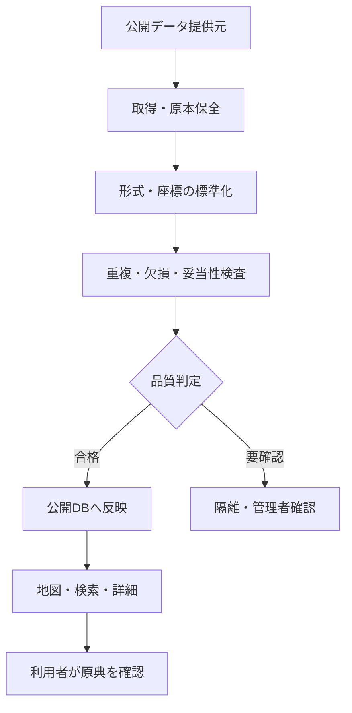
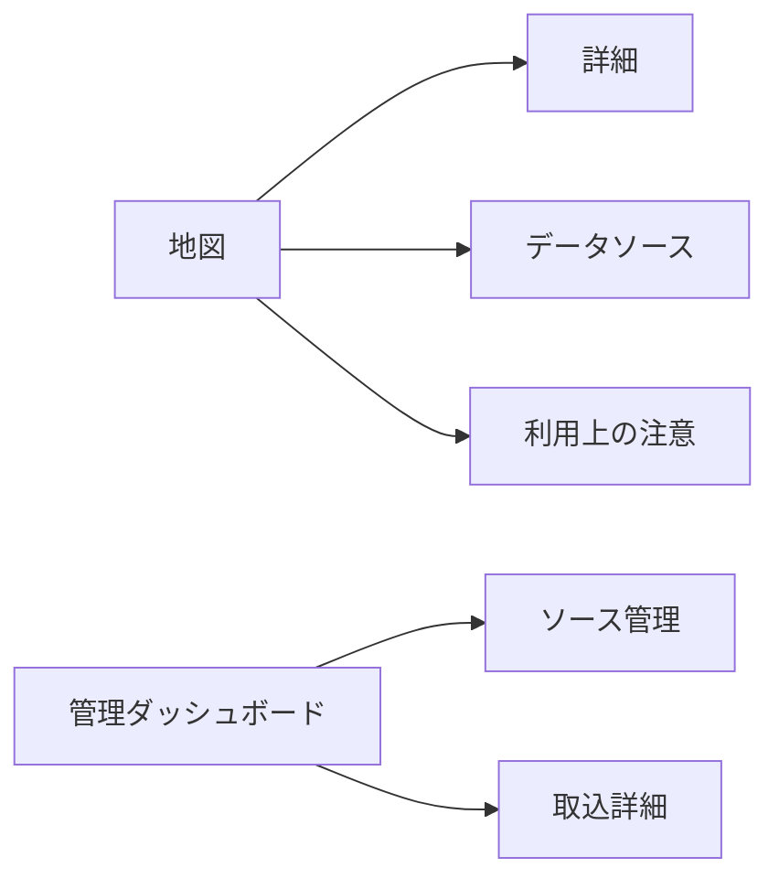
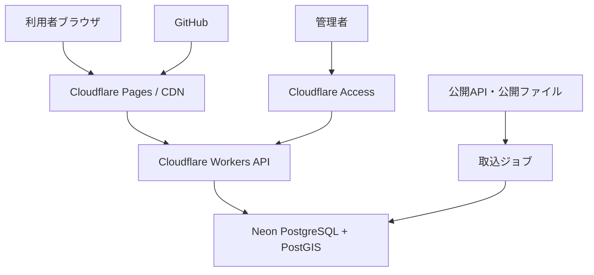

# Public Infrastructure Maintenance Map 要件定義書

> 公開インフラ維持管理マップ — 公開情報からインフラ調査の入口を提供するWeb GIS

| 項目 | 内容 |
| --- | --- |
| 文書版 | 1.0 |
| 作成日 | 2026-07-16 |
| リポジトリ | https://github.com/Kensan196948G/Public-Infrastructure-Maintenance-Map.git (`Public-Infrastructure-Maintenance-Map` )|
| 対象 | Webアプリケーション（PC／タブレット／スマートフォン） |
| 開発・運用基盤 | Claude Code on Linux／GitHub／Cloudflare／Neon PostgreSQL |
| データ方針 | 公開データ・公開API・検証用サンプルのみ。会社資産・社内情報は使用しない |

## 1. プロジェクト概要

### 1.1 背景

橋梁、道路、港湾、河川、公共施設などの情報は、国・自治体・各管理主体のWebサイト、オープンデータ、GISデータに分散している。初期調査では複数サイトの検索、形式変換、位置確認が必要であり、情報の所在を把握するだけでも負荷が高い。

本システムは、公開情報を共通形式へ整え、地図・一覧・詳細画面から横断的に確認できる入口を提供する。

### 1.2 目的

- 公開インフラ情報を一つの地図上で横断確認できるようにする。
- 維持管理、現地調査、計画検討、研究の初期調査時間を短縮する。
- 各情報の出典、取得日時、更新日、利用条件を追跡可能にする。
- 欠損、重複、古さを可視化し、原典確認が必要な情報を明示する。
- 後続のリスク確認、搬入計画、防災、維持管理DXへ再利用できる公開データ基盤を形成する。

### 1.3 本システムが行わないこと

- 構造物の健全性、安全性、劣化度、通行可否を断定しない。
- 法定点検、現地調査、管理者照会、専門技術者の判断を代替しない。
- 私有・非公開・社内管理台帳、個人情報、契約情報を収集しない。
- 原典にない情報をAI等で補完して事実として表示しない。
- 公開データの再配布条件を無視した保存・配信を行わない。

## 2. 対象利用者

| 利用者 | 主な利用目的 |
| --- | --- |
| 土木建設現場技術者 | 周辺構造物・河川・道路等の初期確認 |
| 現場管理者 | 調査対象と関係管理主体の洗い出し |
| 維持管理担当者 | 公開台帳・点検関連情報への入口確認 |
| 土木建設研究者 | 地域・種別・年代別の公開情報探索 |
| 経営・企画層 | 公開情報に基づく地域傾向の俯瞰 |
| IT・DX担当者 | データソース、取得状況、品質の管理 |
| 一般閲覧者 | 公開範囲のインフラ情報閲覧 |

## 3. スコープ

### 3.1 MVP対象

1. 橋梁、道路、港湾、河川、公共施設のうち、利用可能な公開データを登録する。
2. 地図表示、現在地・住所・座標・施設名検索を提供する。
3. インフラ種別、管理主体、行政区域、更新日、品質状態で絞り込む。
4. 詳細画面で属性、出典、原典URL、取得日時、ライセンス、注意事項を表示する。
5. データソース台帳、取込ジョブ、取込ログ、品質検査結果を管理する。
6. 表示中の公開情報をCSV／GeoJSONで出力する。ただしライセンス条件により禁止・制限できる。
7. 管理者向けに再取得、無効化、品質確認を提供する。

### 3.2 将来拡張

- 時系列比較、差分表示、更新通知、お気に入り、共有URL
- ベクトルタイル、クラスタリング、ヒートマップ
- PWAによる限定的オフライン参照
- `Civil-Open-Data-Intelligence-Platform`、`Global-Civil-API-Catalog`との連携
- `Bridge-Tunnel-Public-Data-Explorer`を本システムの専門ビューとして統合
- iOS/iPadOS用 `Infrastructure Map Mobile` の閲覧API

## 4. 業務フロー

## 5. 機能要件

| ID | 機能 | 要件 | 優先度 |
| --- | --- | --- | --- |
| FR-01 | 地図表示 | 背景地図と公開インフラを重ねて表示する | Must |
| FR-02 | レイヤー制御 | 種別ごとに表示／非表示、凡例、件数を切り替える | Must |
| FR-03 | 検索 | 施設名、住所、自治体名、管理主体、座標で検索する | Must |
| FR-04 | 絞り込み | 種別、区域、管理主体、更新期間、品質状態で絞り込む | Must |
| FR-05 | 詳細表示 | 標準属性、固有属性、出典、品質、原典リンクを表示する | Must |
| FR-06 | 一覧連動 | 地図範囲内の結果を一覧表示し、選択を相互連動する | Must |
| FR-07 | 共有 | 検索条件と表示位置を再現できるURLを生成する | Should |
| FR-08 | エクスポート | 許諾範囲内でCSV／GeoJSONを出力する | Should |
| FR-09 | ソース台帳 | 提供者、URL、形式、頻度、ライセンス、責任者を管理する | Must |
| FR-10 | データ取込 | API／CSV／GeoJSON等を取得し、ステージングへ保存する | Must |
| FR-11 | クレンジング | 文字、日付、単位、座標系、行政コードを標準化する | Must |
| FR-12 | 品質検査 | 欠損、範囲外座標、重複、異常値、鮮度を検査する | Must |
| FR-13 | 取込監査 | 実行日時、件数、成功／失敗、ハッシュ、エラーを記録する | Must |
| FR-14 | 公開制御 | ソース／レコード単位で公開停止・理由記録を可能にする | Must |
| FR-15 | フィードバック | 誤り候補を、対象IDと理由付きで報告できる | Could |

## 6. 画面要件

| ID | 画面 | 主な内容 |
| --- | --- | --- |
| UI-01 | トップ／地図 | 地図、検索、レイヤー、凡例、結果一覧、注意表示 |
| UI-02 | インフラ詳細 | 基本属性、位置、固有属性、品質、出典、原典リンク |
| UI-03 | データソース | 公開元、対象範囲、更新状況、利用条件 |
| UI-04 | 利用上の注意 | 免責、利用規約、プライバシー、ライセンス |
| UI-05 | 管理ダッシュボード | 取込状況、要確認、失敗、鮮度、件数 |
| UI-06 | ソース管理 | ソース台帳、取得設定、公開可否 |
| UI-07 | 取込詳細 | ジョブログ、品質検査、エラー、再実行 |

## 7. データ要件

### 7.1 対象カテゴリ

| カテゴリ | 代表属性（取得できる範囲） |
| --- | --- |
| 橋梁 | 名称、路線、管理主体、供用年、橋長、位置、公開点検情報 |
| 道路 | 路線名、区分、管理主体、区間、位置形状 |
| 港湾 | 港湾名、施設区分、管理主体、位置形状 |
| 河川 | 河川名、水系、管理主体、区間、施設種別、位置形状 |
| 公共施設 | 名称、施設区分、設置者、所在地、位置 |

### 7.2 共通必須メタデータ

- システム内ID、インフラ種別、名称、位置情報
- 提供元名、データセット名、原典URL
- 原典レコードID、取得日時、原典更新日
- ライセンス／利用条件、再配布可否
- 取込バージョン、原本ハッシュ、品質状態、公開状態

### 7.3 データクレンジング

1. 文字コードをUTF-8、UnicodeをNFCへ統一する。
2. 全角・半角、空白、名称表記を正規化し、原文も保持する。
3. 日付をISO 8601、長さ等の単位をSI単位へ標準化する。
4. 座標参照系を識別してWGS 84へ変換し、原座標系を記録する。
5. 行政区域コード等を共通コードへ対応付ける。
6. 提供元IDを優先し、名称・近接距離・属性類似度で重複候補を検出する。
7. 必須値欠損、国内範囲外座標、不正形状、論理矛盾を隔離する。
8. 原データ、変換結果、除外理由を追跡可能にする。

### 7.4 品質表示

| 状態 | 意味 |
| --- | --- |
| 確認済み | 自動検査を通過し、必要時に管理者確認済み |
| 要確認 | 欠損・重複・鮮度・座標等に注意が必要 |
| 参考 | 属性が限定的または更新日不明 |
| 非公開 | ライセンス、誤り、障害等により表示停止 |

## 8. 非機能要件

| ID | 分類 | 要件 |
| --- | --- | --- |
| NFR-01 | 性能 | 通常の地図初期表示を3秒以内、検索を2秒以内の目標とする（代表条件） |
| NFR-02 | 可用性 | 検証段階99.0%、本番候補99.5%を月間目標とする |
| NFR-03 | 拡張性 | データソース追加をアダプター方式で実装する |
| NFR-04 | セキュリティ | TLS、入力検証、レート制限、依存関係検査、秘密情報のSecret保管を行う |
| NFR-05 | プライバシー | 位置情報は明示許可時のみ利用し、既定で永続保存しない |
| NFR-06 | アクセシビリティ | WCAG 2.2 AAを目標とし、色だけに依存しない表示を行う |
| NFR-07 | 対応環境 | 最新2世代の主要ブラウザ、レスポンシブ表示に対応する |
| NFR-08 | 監査 | 管理操作、取込、公開状態変更を改ざん困難なログへ記録する |
| NFR-09 | 保守性 | 型、Lint、単体・統合・E2Eテスト、API仕様をCIで検査する |
| NFR-10 | バックアップ | Neonの復旧機能を用い、復元手順を定期検証する |

## 9. セキュリティ・法務要件

- WebUIやリポジトリへAPIキー・DB接続情報を埋め込まない。
- `.env`をGit管理せず、`.env.example`のみ管理する。
- 管理画面はCloudflare Access等で認証・認可し、最小権限を適用する。
- 公開APIにはレート制限、CORS制限、サイズ上限、タイムアウトを設ける。
- SSRF、SQLインジェクション、XSS、パストラバーサル対策を実装する。
- robots.txt、利用規約、API規約に反する収集を行わない。
- 出典表示、帰属表示、改変表示、再配布条件をデータセットごとに適用する。
- 誤情報報告時は当該レコードを一時的に「要確認」または非公開にできる。

## 10. システム構成要件

- Linuxローカルは開発・ビルド・一時検証のみとし、正本を置かない。
- GitHubをソースコード・設計書・READMEの正本とする。
- Cloudflareを検証公開、API、入口制御の基盤とする。
- Neon PostgreSQL＋PostGISをアプリケーションデータの正本とする。

## 11. 運用要件

- 取得頻度はデータ提供元の更新頻度・規約・負荷を考慮して設定する。
- 取込失敗、品質悪化、更新停滞、API上限接近を通知する。
- 原典削除や規約変更時に該当データを追跡・非公開化できるようにする。
- 月次でソース鮮度、失敗率、要確認件数、ライセンス変更を棚卸しする。
- 障害時は前回正常スナップショットを継続表示し、更新停止を明示する。

## 12. 受入基準

1. 2種以上のインフラ、3つ以上の公開データソースを地図表示できる。
2. 地図、検索、絞り込み、一覧、詳細が相互に整合する。
3. 全表示レコードから出典、取得日時、原典URL、品質状態を確認できる。
4. 重複、欠損、不正座標を検出し、公開データから隔離できる。
5. ライセンスに応じて表示・エクスポートを制御できる。
6. 管理画面が一般利用者から保護され、主要な脆弱性検査を通過する。
7. 取込失敗時に既存公開データを破壊せず、再実行できる。
8. PC・タブレット・スマートフォンで主要操作が可能である。
9. 「参考情報であり原典確認が必要」と明確に表示される。

## 13. KPI

| 指標 | MVP目標 |
| --- | --- |
| 登録データソース数 | 3以上 |
| 対象インフラ種別 | 2以上 |
| 出典メタデータ充足率 | 100% |
| 取込成功率 | 95%以上 |
| 重大な重複・不正座標の公開 | 0件 |
| 初期調査時間 | 従来比30%削減を検証 |

## 14. リスクと対策

| リスク | 対策 |
| --- | --- |
| データ形式・項目の変更 | ソース別アダプター、契約テスト、失敗時隔離 |
| 更新頻度・精度のばらつき | 鮮度・品質バッジ、原典更新日表示 |
| 同一施設の重複 | 提供元ID＋空間・名称照合、候補レビュー |
| 座標系誤認 | CRS明示、範囲検査、変換ログ |
| 利用規約変更 | 台帳化、定期棚卸し、即時公開停止 |
| 地図情報の過信 | 免責、原典リンク、断定表現の禁止 |
| 大量描画による遅延 | 範囲検索、クラスタ、簡略化、ベクトルタイル化 |

## 15. 用語

| 用語 | 説明 |
| --- | --- |
| GIS | 地理情報を地図上で管理・分析する仕組み |
| PostGIS | PostgreSQLで地理空間データを扱う拡張 |
| CRS | 座標参照系。座標がどの基準に基づくかを示す |
| GeoJSON | 地理形状と属性をJSONで表現する形式 |
| 原典 | 情報を公開した管理主体・データセット |

---

本書は「何を、なぜ、どこまで実現するか」を定義する。実装構造と処理の詳細は `Public-Infrastructure-Maintenance-Map_詳細設計仕様書_20260716.md` を参照する。
