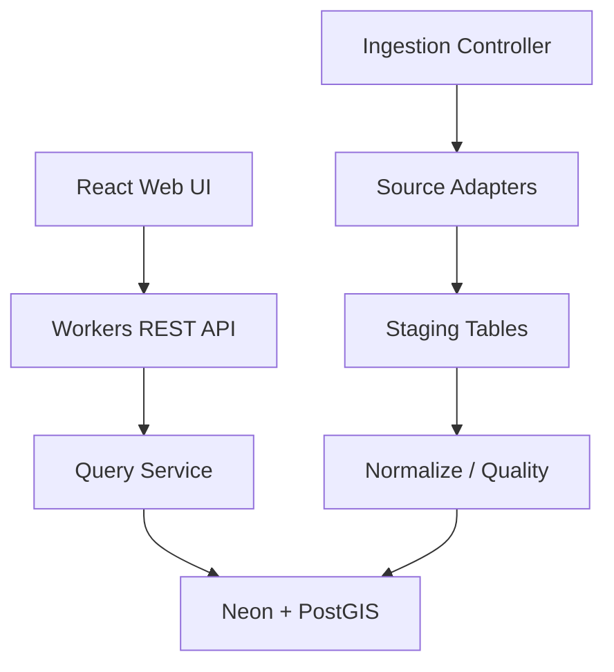
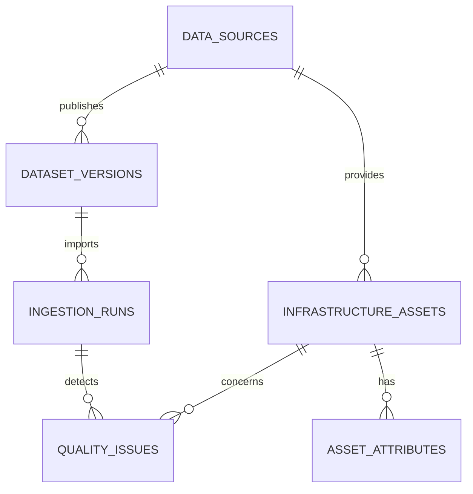
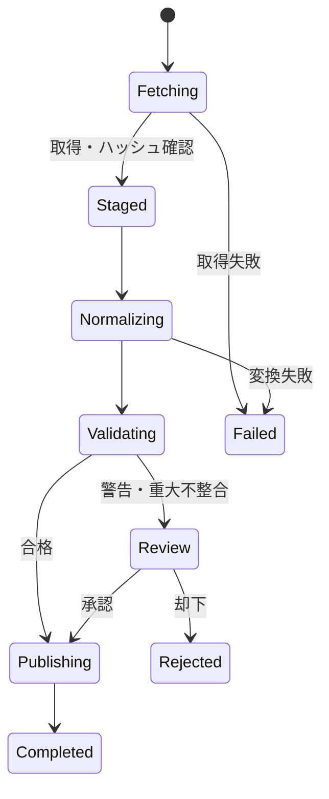
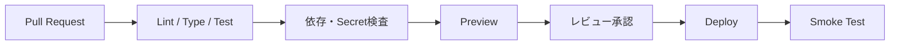

# Public Infrastructure Maintenance Map 詳細設計仕様書

| 項目 | 内容 |
| --- | --- |
| 文書版 | 1.0 |
| 作成日 | 2026-07-16 |
| 対応要件定義 | `Public-Infrastructure-Maintenance-Map_要件定義書_20260716.md` |
| リポジトリ | `Public-Infrastructure-Maintenance-Map` |

## 1. 設計方針

- 公開情報の閲覧・検索・出典確認を中心とする。
- 原データ、標準化データ、公開データを分離し、処理の追跡性を確保する。
- データソース固有処理をアダプターへ閉じ込め、共通パイプラインを再利用する。
- API、DB、画面で同一の型・列挙値・エラー体系を使用する。
- 会社資産・社内情報を接続しない。

## 2. 技術スタック（推奨）

| 層 | 技術 |
| --- | --- |
| フロントエンド | TypeScript、React、Vite、MapLibre GL JS、TanStack Query |
| API | Cloudflare Workers、Hono、Zod、OpenAPI |
| DB | Neon PostgreSQL、PostGIS |
| 取込処理 | TypeScript Worker／GitHub Actions（長時間処理は段階実行） |
| ORM／SQL | Drizzle ORM＋空間SQL（PostGIS部分は明示SQL） |
| テスト | Vitest、React Testing Library、Playwright |
| 品質 | ESLint、Prettier、TypeScript strict、依存関係監査 |
| CI/CD | GitHub Actions、Cloudflare Pages／Workers |

採用ライブラリのバージョンは実装開始時に公式情報を確認し、固定・更新方針を定める。

## 3. 論理構成



### 3.1 コンポーネント

| コンポーネント | 責務 |
| --- | --- |
| Web UI | 地図、検索、詳細、ソース情報、管理画面 |
| Public API | 閲覧、検索、凡例、共有条件、出力 |
| Admin API | ソース設定、取込実行、品質レビュー、公開制御 |
| Ingestion | 取得、原本記録、変換、検査、反映 |
| Query Service | 空間範囲、属性検索、ページング、集計 |
| Audit Service | 管理操作・取込・公開状態変更の記録 |

## 4. リポジトリ構成

```text
Public-Infrastructure-Maintenance-Map/
├─ apps/
│  ├─ web/
│  └─ api/
├─ packages/
│  ├─ contracts/
│  ├─ database/
│  ├─ ingestion-core/
│  ├─ source-adapters/
│  └─ ui/
├─ migrations/
├─ tests/
│  ├─ fixtures/
│  ├─ integration/
│  └─ e2e/
├─ docs/
├─ scripts/
├─ .github/workflows/
├─ .env.example
├─ README.md
└─ LICENSE
```

## 5. データモデル



### 5.1 主要テーブル

#### `data_sources`

| 列 | 型 | 制約・説明 |
| --- | --- | --- |
| id | uuid | PK |
| slug | varchar(100) | UNIQUE、URL安全な識別子 |
| name | text | NOT NULL |
| provider_name | text | NOT NULL |
| source_url | text | NOT NULL |
| access_type | varchar(20) | api／file／manual |
| format | varchar(30) | csv／geojson／json等 |
| license_name | text | NOT NULL |
| license_url | text | NULL可 |
| redistribution | varchar(20) | allowed／restricted／prohibited／unknown |
| refresh_cron | text | NULL可 |
| enabled | boolean | DEFAULT false |
| config_json | jsonb | 秘密情報を含めない |
| created_at | timestamptz | NOT NULL |
| updated_at | timestamptz | NOT NULL |

#### `dataset_versions`

| 列 | 型 | 説明 |
| --- | --- | --- |
| id | uuid | PK |
| source_id | uuid | FK |
| source_updated_at | timestamptz | 原典更新日時 |
| fetched_at | timestamptz | 取得日時 |
| content_hash | char(64) | SHA-256 |
| schema_fingerprint | char(64) | 項目構成検知用 |
| raw_reference | text | 原本保存先または参照情報 |
| record_count | integer | 原本件数 |
| status | varchar(20) | fetched／validated／published／rejected |

#### `infrastructure_assets`

| 列 | 型 | 説明 |
| --- | --- | --- |
| id | uuid | PK |
| source_id | uuid | FK |
| source_record_id | text | 提供元ID |
| asset_type | varchar(30) | bridge／road／port／river／public_facility |
| name | text | 正規化名称 |
| original_name | text | 原文名称 |
| geometry | geometry(Geometry,4326) | 点・線・面 |
| prefecture_code | char(2) | NULL可 |
| municipality_code | char(5) | NULL可 |
| managing_authority | text | NULL可 |
| source_updated_at | timestamptz | NULL可 |
| quality_status | varchar(20) | verified／review／reference／hidden |
| publication_status | varchar(20) | draft／published／suspended |
| valid_from | timestamptz | NULL可 |
| valid_to | timestamptz | NULL可 |
| created_at | timestamptz | NOT NULL |
| updated_at | timestamptz | NOT NULL |

一意性は原則 `UNIQUE(source_id, source_record_id)` とする。提供元IDがない場合は安定した複合値から決定的IDを生成する。

#### `asset_attributes`

| 列 | 型 | 説明 |
| --- | --- | --- |
| asset_id | uuid | FK |
| key | varchar(100) | 属性キー |
| value_text | text | 表示値 |
| value_number | numeric | 数値検索用 |
| unit | varchar(20) | SI単位 |
| original_value | text | 原文値 |
| source_label | text | 原項目名 |

#### `ingestion_runs`

`id`, `source_id`, `dataset_version_id`, `started_at`, `finished_at`, `status`, `fetched_count`, `accepted_count`, `rejected_count`, `warning_count`, `error_code`, `error_summary`, `triggered_by`, `correlation_id`を保持する。

#### `quality_issues`

`id`, `run_id`, `asset_id`, `rule_code`, `severity`, `field_name`, `observed_value`, `message`, `resolution_status`, `resolved_by`, `resolved_at`を保持する。

### 5.2 空間インデックス

```sql
CREATE INDEX idx_assets_geometry
ON infrastructure_assets USING GIST (geometry);

CREATE INDEX idx_assets_type_status
ON infrastructure_assets (asset_type, publication_status, quality_status);

CREATE INDEX idx_assets_name_trgm
ON infrastructure_assets USING GIN (name gin_trgm_ops);
```

## 6. 取込パイプライン



### 6.1 アダプター契約

```ts
interface SourceAdapter<RawRecord> {
  fetch(context: FetchContext): Promise<FetchResult>;
  parse(input: FetchResult): AsyncIterable<RawRecord>;
  normalize(record: RawRecord): NormalizedAsset;
  validate(asset: NormalizedAsset): QualityIssue[];
}
```

### 6.2 共通処理

1. ソース有効性と利用条件を確認する。
2. 条件付きGET（ETag／Last-Modified）を使用する。
3. 応答サイズ、Content-Type、タイムアウトを検査する。
4. SHA-256が前回と同一なら不要な再処理を省略する。
5. 原本参照とスキーマ指紋を記録する。
6. バッチ単位でステージングへ投入する。
7. 正規化・品質検査後、トランザクションで公開テーブルへ反映する。
8. 失敗時は現行公開版を保持し、ステージングのみ破棄可能にする。

### 6.3 品質ルール例

| コード | 検査 | 重大度 | 動作 |
| --- | --- | --- | --- |
| Q001 | 名称欠損 | warning | `参考`として扱う |
| Q002 | 位置情報欠損 | error | 公開対象から隔離 |
| Q003 | 日本域外の座標 | error | 隔離 |
| Q004 | 不正Geometry | error | 修復を試行し、失敗時隔離 |
| Q005 | 重複候補 | warning | `要確認` |
| Q006 | 原典更新日不明 | warning | 鮮度不明を表示 |
| Q007 | ライセンス不明 | error | 非公開 |
| Q008 | スキーマ変更 | error | 取込停止、管理者通知 |

重複候補は、同一種別かつ正規化名称一致、代表点間距離が設定値以内、主要属性一致度が閾値以上の場合に生成する。自動統合は原則行わず、提供元別レコードを維持する。

## 7. API設計

### 7.1 共通

- ベース: `/api/v1`
- JSONはUTF-8、日時はISO 8601 UTC、座標はEPSG:4326。
- 一覧はカーソルページングを基本とする。
- `X-Request-Id`を受入または発行し、ログへ連携する。
- エラーはRFC 9457相当のProblem Details形式とする。

### 7.2 公開API

| Method | Path | 用途 |
| --- | --- | --- |
| GET | `/assets` | bbox、種別、行政区域、品質等による検索 |
| GET | `/assets/{id}` | 詳細取得 |
| GET | `/assets/summary` | 表示範囲の種別別件数 |
| GET | `/sources` | 公開データソース一覧 |
| GET | `/sources/{slug}` | ソース詳細・更新状況 |
| GET | `/export` | 許可されたCSV／GeoJSON出力 |
| GET | `/health` | 外形監視用の最小応答 |

`GET /assets`の主要クエリ:

`bbox=minLon,minLat,maxLon,maxLat`、`types=bridge,road`、`q=`、`municipalityCode=`、`quality=`、`updatedSince=`、`limit=`、`cursor=`。

### 7.3 管理API

| Method | Path | 用途 |
| --- | --- | --- |
| POST | `/admin/sources` | ソース登録 |
| PATCH | `/admin/sources/{id}` | 設定・公開状態変更 |
| POST | `/admin/sources/{id}/ingestions` | 取込開始 |
| GET | `/admin/ingestions/{id}` | 実行・品質詳細 |
| POST | `/admin/quality-issues/{id}/resolve` | 品質問題解決 |
| POST | `/admin/assets/{id}/suspend` | レコード公開停止 |

管理APIはCloudflare Accessで認証し、アプリ側でも`admin`／`reviewer`ロールを検証する。

### 7.4 応答例

```json
{
  "id": "018f...",
  "type": "bridge",
  "name": "公開情報上の橋梁名",
  "geometry": {"type": "Point", "coordinates": [139.0, 35.0]},
  "quality": {"status": "review", "updatedAtKnown": true},
  "source": {
    "provider": "公開データ提供者",
    "dataset": "データセット名",
    "sourceUrl": "https://example.invalid/source",
    "fetchedAt": "2026-07-16T00:00:00Z"
  }
}
```

## 8. 画面詳細

### 8.1 地図画面

- 上部: 製品名、キーワード検索、ヘルプ。
- 左パネル: 種別、管理主体、行政区域、鮮度、品質フィルター。
- 中央: 地図、クラスタ、現在地、ズーム、縮尺。
- 右／下パネル: 範囲内一覧。モバイルではボトムシート。
- 常時表示: 「参考情報。最新情報・判断は原典と管理主体へ確認」の注意書き。
- URLへ中心座標、ズーム、レイヤー、主要フィルターを保存する。

### 8.2 詳細画面

表示順は、概要 → 位置 → 公開属性 → 品質・鮮度 → 出典・利用条件 → 注意事項とする。欠損値は「不明」とし、推定表示しない。

### 8.3 管理画面

取込状態を成功・警告・失敗・停止で表示し、失敗件数だけでなく直近正常公開版の有無を示す。破壊的な公開停止は確認画面と理由入力を必須とする。

## 9. セキュリティ設計

- SecretはCloudflare／GitHubのSecret管理機能へ保存する。
- DB接続はTLS、用途別資格情報、最小権限、接続プールを使用する。
- 管理APIはAccess認証情報の署名・audience・有効期限を検証する。
- 外部取得先はソース台帳の許可ホストへ限定し、リダイレクト先も検査する。
- SQLはプレースホルダーを使用し、動的識別子を許可リスト化する。
- CSP、HSTS、X-Content-Type-Options、Referrer-Policyを設定する。
- 公開APIへIP／トークン単位のレート制限とbbox最大面積を設定する。
- CSV Formula Injection対策として危険な先頭文字を無害化する。

## 10. ログ・監視

### 10.1 構造化ログ

`timestamp`, `level`, `service`, `environment`, `request_id`, `correlation_id`, `event`, `source_id`, `run_id`, `duration_ms`, `status_code`, `error_code`をJSONで出力する。APIキー、DB URI、個人の正確な現在地、原本全文は出力しない。

### 10.2 監視指標

- APIレイテンシ、5xx率、リクエスト数、レート制限数
- 取込成功率、処理時間、取得・採用・隔離件数
- データソース最終成功日時、鮮度超過数、スキーマ変更
- DB容量、接続数、空間クエリの低速件数

## 11. キャッシュ・性能

- 静的アセットは内容ハッシュ付きで長期キャッシュする。
- 公開APIはクエリ正規化後のキーで短時間キャッシュする。
- 管理API、個別品質問題、エクスポートは原則キャッシュしない。
- bboxに上限を設け、ズームが粗い場合は個別形状でなく集計を返す。
- Geometryは表示ズームに応じて簡略化し、将来はベクトルタイルへ移行する。

## 12. エラー処理

| コード | 意味 | HTTP |
| --- | --- | --- |
| VALIDATION_ERROR | 入力不正 | 400 |
| UNAUTHORIZED | 未認証 | 401 |
| FORBIDDEN | 権限不足 | 403 |
| NOT_FOUND | 対象なし | 404 |
| RATE_LIMITED | 上限超過 | 429 |
| SOURCE_UNAVAILABLE | 外部提供元障害 | 502 |
| INGESTION_SCHEMA_CHANGED | 原典スキーマ変更 | 409 |
| INTERNAL_ERROR | 予期しない障害 | 500 |

利用者向けメッセージに内部構造や秘密情報を出さず、`request_id`を案内する。

## 13. テスト設計

| レベル | 主な対象 |
| --- | --- |
| 単体 | 正規化、座標、日付、単位、ライセンス制御、品質ルール |
| 契約 | ソースアダプターの固定fixture、スキーマ変更検出 |
| 統合 | API＋PostGIS、bbox検索、トランザクション、ロール制御 |
| E2E | 地図検索→絞込→詳細→原典、管理取込→品質確認 |
| 性能 | 高密度地域、広域bbox、クラスタ、同時検索 |
| セキュリティ | OWASP主要項目、認可、SSRF、注入、レート制限 |
| アクセシビリティ | キーボード、フォーカス、読み上げ、コントラスト |

必須fixtureには、正常、欠損、重複、座標逆転、異なるCRS、不正Geometry、スキーマ変更、ライセンス不明を含める。

## 14. CI/CD



- PRごとに型、Lint、単体、統合、ビルド、Secret検査を実行する。
- Previewはサンプルデータのみで構築する。
- 本番候補デプロイには環境承認とDB migrationレビューを必須とする。
- migrationは後方互換を優先し、expand → migrate → contractで実施する。
- Smoke Test失敗時は直前デプロイへ切り戻し、DBの破壊的ロールバックは行わない。

## 15. バックアップ・復旧

- DBはNeonのバックアップ／ポイントインタイム復旧機能を前提にする。
- ソース定義、migration、変換コードはGitHubを正本とする。
- 公開データは原典から再構築できる設計とし、再取得不能データの保持条件を台帳化する。
- 四半期ごとに検証環境へ復元し、件数、主要検索、出典リンクを確認する。
- RPO／RTOは運用開始前に契約プランと業務重要度から確定する。

## 16. 実装順序

1. モノレポ、CI、環境分離、契約型を準備する。
2. PostGIS schema、migration、サンプルデータを実装する。
3. 公開APIのbbox検索、詳細、ソース一覧を実装する。
4. 地図、レイヤー、一覧、詳細を実装する。
5. 1つ目のソースアダプターと品質パイプラインを実装する。
6. 管理画面、取込監査、公開制御を実装する。
7. 追加ソース、エクスポート、共有URLを実装する。
8. 性能・セキュリティ・アクセシビリティ・復旧を検証する。

## 17. 完了条件

- 要件定義書の受入基準をすべて満たす。
- 主要処理、API、DB、運用手順が文書化されている。
- 重大・高リスク脆弱性が未解決で残っていない。
- サンプルデータから本番候補データへの切替が設定で行える。
- 取込失敗、公開停止、復元の手順を第三者が再現できる。
- READMEのセットアップ、注意事項、構成図が実装と一致する。
