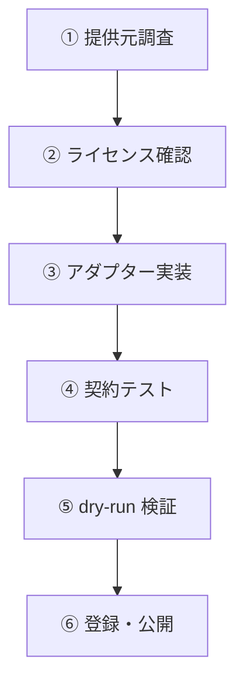

# 📦 アダプター追加ガイド（Adapter Onboarding Guide）

> 対象: Issue #55（データソース拡張基盤）
> 目的: 新規の公開データソースを 30〜100 規模まで安全に追加するための定型手順。
> 前提: `packages/source-adapters` の既存アダプター（sample-bridges 等）をテンプレートとして参照する。

## 1. 追加フロー概要



各ステップの完了条件を以下に示す。**ライセンス確認（②）は必ず先に行う**。利用条件を確認できないデータは追加しない（設計方針: ライセンス不明は Q007 で隔離されるため、実質的に公開不能）。

## 2. ステップ① 提供元調査

| 確認項目 | 内容 | 完了条件 |
| --- | --- | --- |
| 提供元 | 国・自治体・公的機関の正式な公開ページ | 提供元名と URL が特定できる |
| データ種別 | 橋梁 / 道路 / 港湾 / 河川 / 公共施設 のいずれか | `asset_type` が決定できる |
| 更新頻度 | 公開ページに記載の更新間隔 | `refresh_cron` 設計の材料になる |
| データ形式 | CSV / GeoJSON / JSON / XML | `format` が決定できる |
| 座標系 | データに明記された CRS | `crs` が決定できる（推測禁止・設計書 §7.3-4） |
| 項目定義 | 各フィールドの意味と型 | `expectedSchemaKeys` が設計できる |

**注意**: データ形式や項目が未公開・不明瞭な場合は追加しない。`expectedSchemaKeys` が契約に含まれ、乖離時に Q008 で取込が abort されるため、最初から正確に定義する。

## 3. ステップ② ライセンス確認チェックリスト

[ADAPTER_LICENSE_CHECKLIST.md](./ADAPTER_LICENSE_CHECKLIST.md) を使用する。要点:

- `redistribution` は `allowed` / `restricted` / `prohibited` / `unknown` の4値。
- **非商用条件**は `restricted` として `attributionText` に明記する（例: 港湾 C02）。
- 再配布禁止・営利利用禁止のデータは `prohibited` とし、エクスポートから除外される。
- ライセンス URL が無い・曖昧な場合は `licenseName: null`（→ Q007 で隔離）ではなく、**提供元への確認を必須**とする。

## 4. ステップ③ アダプター実装

既存アダプターをテンプレートとして新規ファイルを作成する:

```text
packages/source-adapters/src/adapters/<slug>.ts
```

実装すべきメソッド（`SourceAdapter<Raw>` 契約）:

| メソッド | 責務 | 注意 |
| --- | --- | --- |
| `descriptor` | 静的登録情報（slug / license / crs 等） | `crs` は推測禁止。`expectedSchemaKeys` を含める |
| `fetch(context)` | 公開 API / ファイルの取得 | `context.now` を使用し、`Date.now()` を呼ばない |
| `parse(input)` | 生データをレコードへ変換 | 巨大ファイル（W05 の 149MB XML 等）はイテレータで処理 |
| `normalize(record)` | WGS 84 への変換・属性正規化 | 緯度経度の入替・和暦→ISO 等の既存ルールを再利用 |
| `schemaKeys(records)` | 観測されたキー一覧 | `expectedSchemaKeys` との比較に使用（Q008） |

### 4.1 座標系変換

- `SupportedCrs` に無い CRS は `packages/ingestion-core/src/coords.ts` へ追加してから利用する。
- 変換は `normalize` 内で実施し、**原座標系を descriptor.crs に記録**する（要件 §7.3-4）。
- 緯度経度の入替は既存テスト（`normalize.test.ts`）で固定されたルールに従う。

### 4.2 属性の正規化

- 和暦→ISO 8601、全角→半角、SI 単位への変換は `packages/ingestion-core` の共通関数を再利用する。
- 変換できない値は `original_value` として保持し、推定・書換をしない（設計方針）。

## 5. ステップ④ 契約テスト

新規アダプターには `packages/source-adapters/test/<slug>.test.ts` を追加し、以下を検証する:

1. `descriptor` の各フィールドが有効（slug は kebab-case・URL は https・license は4値のいずれか）
2. 正常系: サンプルレコードが正しく `NormalizedAsset` へ変換される
3. 異常系: 日本域外の座標・欠損・形式違いが隔離される
4. 緯度経度の入替が検出・修正される
5. `schemaKeys` が `expectedSchemaKeys` と一致する（乖離で Q008 発火）

**参考**: `packages/source-adapters/test/road-n13.test.ts`・`river-w05.test.ts` の構成を踏襲する。

## 6. ステップ⑤ dry-run 検証

```bash
pnpm ingest --source <slug>            # dry-run（品質レポートのみ）
pnpm ingest --source <slug> --publish  # 本番DBへ反映（要 DATABASE_URL・承認範囲内のみ）
```

dry-run の確認項目:

| 項目 | 期待値 |
| --- | --- |
| fetched / accepted / rejected 件数 | rejected=0（隔離ゼロ）が理想 |
| Q ルール発火 | Q001〜Q008 のうち意図したもののみ |
| メモリ・所要時間 | W05 等の大容量は有界であること（県別分割等） |
| 緯度経度入替 | 0 件（テストで固定済み） |

## 7. ステップ⑥ 登録・公開

1. `packages/source-adapters/src/registry.ts` の `listAdapters()` へ追加
2. `packages/source-adapters/test/seed.test.ts` の `registry` テストへ期待値を追加
3. CI（lint / typecheck / test / build / PostGIS integration）を通過させる
4. 本番投入はリリース手順（`docs/RELEASE_RUNBOOK.md`）に従い、件数突合と rollback 手順を明記して承認範囲で実行

## 8. スキーマ差分レビュー

新規追加時に `expectedSchemaKeys` が既存アダプターと衝突しないことを確認する:

```bash
# 全アダプターの descriptor と expectedSchemaKeys を一覧表示
pnpm --filter @pimm/source-adapters exec tsx -e "
  import { listAdapters } from './src/registry.js';
  for (const a of listAdapters()) {
    console.log(a.descriptor.slug, '|', a.descriptor.licenseName, '|', a.descriptor.crs, '|', a.descriptor.redistribution);
  }
"
```

同一 slug の重複・CRS の誤認・ライセンスの矛盾がないことを確認する。

---

## 9. 関連ドキュメント

- [ADAPTER_LICENSE_CHECKLIST.md](./ADAPTER_LICENSE_CHECKLIST.md) — ライセンス確認の詳細チェックリスト
- `docs/RELEASE_RUNBOOK.md` — 本番投入手順
- `packages/ingestion-core/src/adapter.ts` — アダプター契約の定義
- `packages/source-adapters/src/adapters/` — 既存アダプター実装（テンプレート）
