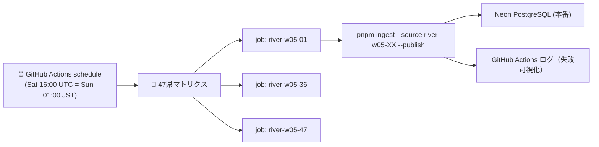

# W05 河川データ自動取込の設計

> 状態: 設計確定 + 外部ランナー（GitHub Actions scheduled workflow）実装済み
> 関連: DL-016 / Issue #55 / `river-w05-XX`（47 県）

## 1. 目的

国土数値情報 河川データ W05 の 47 都道府県ソースを、人手なしで定期的に
取込→Publish する。既存の Cloudflare Cron Trigger（`0 * * * *`）は軽量ソース
（橋梁・大阪・道路・港湾）を対象としており、W05 は以下の制約から別経路で
実行する。

## 2. 制約

| 制約 | 値 | 影響 |
|---|---|---|
| W05 県別 XML サイズ | 最大約 149MB（北海道） | Worker の CPU 時間・メモリ上限を超過しうる |
| 変換処理 | `unzipSync` + 巨大 XML の文字列走査 + MultiLineString 集約 | 1 県あたり数分〜十数分の計算が必要 |
| 実行環境 | 既存 CLI（Node 22 / tsx）が実績 | Node ランタイムで全 47 県の実績あり |

## 3. 代替案比較

| 案 | 概要 | 判定 |
|---|---|---|
| A. Worker で全県実行 | Cron から `river-w05-XX` を直接実行 | ❌ 149MB XML・長時間 CPU が Worker 制約を超える。`nodejs_compat` を入れてもメモリ/時間で不可 |
| B. Cloudflare Queues + Worker 消費者 | Cron がキューへ投入、Worker が消費 | ❌ 消費者が同じ Worker 制約にぶつかる（キュー化だけでは解決しない） |
| C. **GitHub Actions scheduled workflow（採用）** | 週次スケジュール + 47 県マトリクスで既存 `pnpm ingest --publish` を実行 | ✅ Node CLI そのまま・ログ/失敗可視化・認証は GitHub Secrets |
| D. 自前 Node サービス（Fly/Render 等） | 常駐ジョブランナーを立てる | 🟡 運用コスト増。将来のデータ量次第で再検討 |

## 4. 採用設計（C）



### 4.1 実行条件

- スケジュール: 毎週土曜 16:00 UTC（日曜 01:00 JST）
- `workflow_dispatch` で任意県・全県の手動実行も可能
- 47 県をマトリクスで並列実行（GitHub Actions の同時実行制限内でキューイング）
- `DATABASE_URL` は GitHub Actions の Secret として設定（リポジトリ管理者のみ）
- 2026-08-12 より `check-secret` ガード job を追加。Secret 未設定時は 47 ジョブの
  失敗/キャンセルの代わりに 1 ジョブで「DATABASE_URL 未設定」を明確に失敗させる

### 4.2 安全性

- 実行は既存の `ingest --publish`（品質ゲート Q001〜Q008 → hidden 隔離）をそのまま利用
- 失敗はジョブ単位で可視化され、`ingestion_runs.status=failed` に記録される
- 異常時の停止: ワークフロー無効化 or `workflow_dispatch` 停止。DB 側は県単位
  `suspend-assets` で非破壊ロールバック可能
- 認証情報は GitHub Secret のみ（リポジトリ外へ出さない）

## 5. 運用手順

### 初回セットアップ

1. GitHub リポジトリ Settings → Secrets and variables → Actions へ `DATABASE_URL` を追加
   （未設定のまま実行すると `check-secret` ジョブが設定手順を表示して停止する）
2. 手動実行: Actions → **W05 Scheduled Ingest** → Run workflow → `all`
3. 運用ダッシュボード / `ingestion_runs` で 47 県の成功を確認

### 手動・部分実行

```bash
# ローカル全県（既定 dry-run）
node scripts/tools/ingest-river-w05-all.mjs

# ローカル全県 publish
node scripts/tools/ingest-river-w05-all.mjs --publish

# 特定県のみ
node scripts/tools/ingest-river-w05-all.mjs --only 01,36 --publish
```

## 6. 将来の選択肢

- W05 がもっと新年度版へ更新されファイルが軽量化されたら、Cloudflare Queues +
  キュー消費者（Node 互換 Worker）へ移行を再評価
- 大量ソースが増えた場合は、GitHub Actions ではなく専用ジョブランナー
  （Durable Objects による分割処理 etc.）の設計を別途実施
