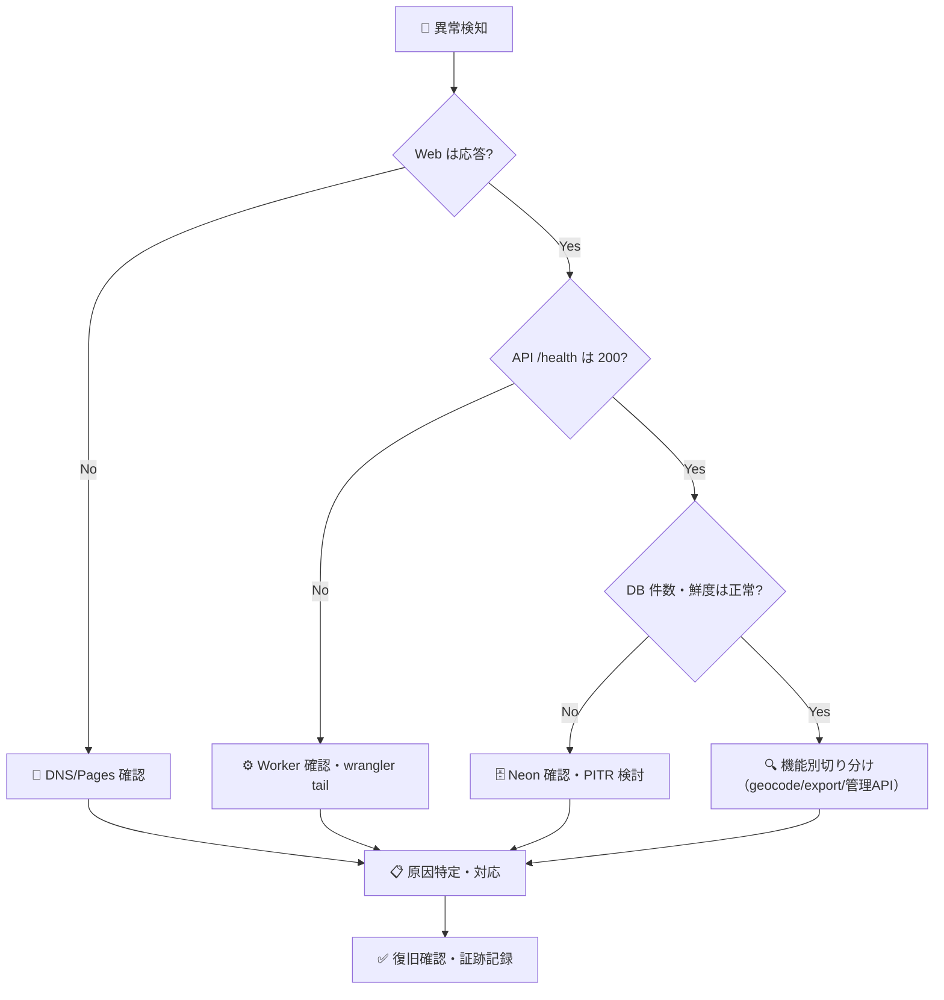

# 🚨 インシデント対応 Runbook

> 📌 対象: 本番の可用性・データ・セキュリティに影響する事象

## 🔢 重大度分類

| 重大度 | 定義 | 例 | 目標初動 |
| --- | --- | --- | --- |
| P1 Critical | サービス全面停止・データ喪失・秘密漏えい | API 全 5xx、DB 障害、トークン漏えい | 10 分以内 |
| P2 High | 主要機能の一部停止・広範囲エラー | geocode 502、取込連続失敗 | 30 分以内 |
| P3 Medium | 機能低下・UX 劣化 | 検索遅延、表示崩れ | 24 時間以内 |
| P4 Low | 軽微・運用上の気付き | ログ不足、ドキュメント誤り | 次回リリース |

## 🧭 切り分けフロー

## ⚡ 初動チェックリスト

1. **影響範囲の特定**: `/api/v1/health`、`/api/v1/assets/summary`、`/sources` を curl で確認
2. **ログ確認**: `npx wrangler tail --env production`（API）／ Neon ダッシュボード（DB）
3. **直近変更の確認**: 最新のデプロイ・PR・Cron 実行時刻
4. **判断**: 前回バージョンへ `wrangler rollback` するか、その場で修正するか
5. **連絡**: 影響がある場合はプロジェクト管理者へ GitHub Issue／メールで報告
6. **復旧確認**: スモーク（`pnpm smoke:cloudflare`）＋利用者向け URL の確認
7. **記録**: `docs/DECISION_LOG.md` と GitHub Issue に経緯・原因・再発防止を記録

## 🔐 セキュリティインシデント

- 秘密（API トークン・接続文字列）の漏えい疑い → **直ちにローテーション**（各ダッシュボードで再発行）
- 影響範囲の調査（アクセスログ・デプロイ履歴）→ 報告 → 再発防止
- 詳細は [MAINTENANCE.md](./MAINTENANCE.md) のローテーション手順を参照

## 📞 連絡先（2026-08-05 時点）

| 対象 | 連絡先 | 備考 |
| --- | --- | --- |
| プロジェクト管理者 | GitHub `Kensan196948G` | 一次対応・最終判断 |
| Cloudflare | ダッシュボードのサポート窓口 | アカウント所有者: kensan1969@gmail.com |
| Neon | ダッシュボードのサポート窓口 | プロジェクト: `pimm-production` |

## 📝 データ訂正

- 誤データの訂正は **理由・影響範囲・検証方法を Issue 化**し、承認後に実施
- 公開済みデータの大量訂正は PITR 復元または再取込（`pnpm ingest --source <slug> --publish`）で実施
